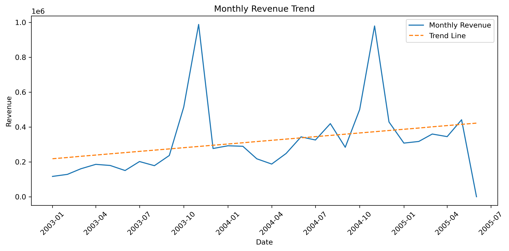
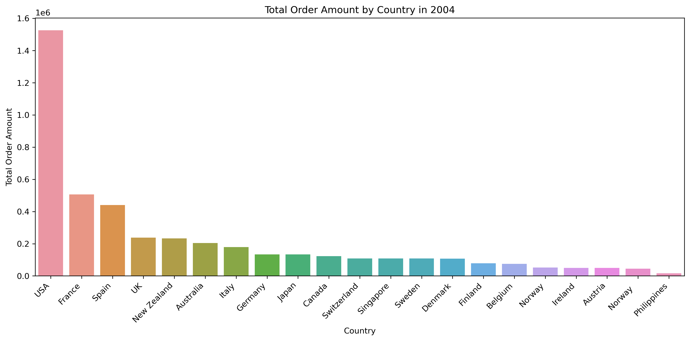
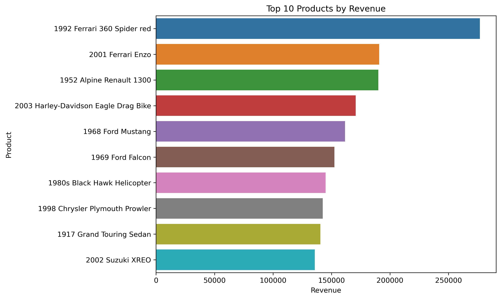
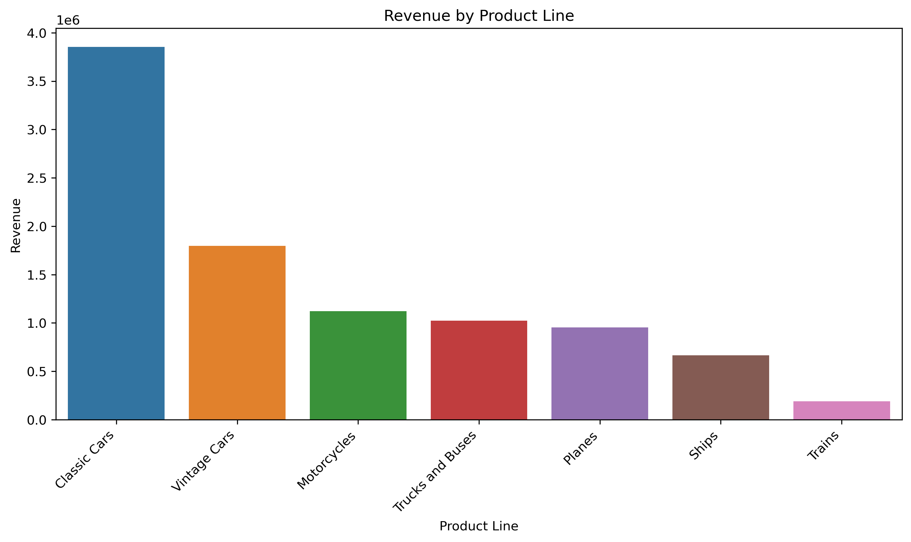
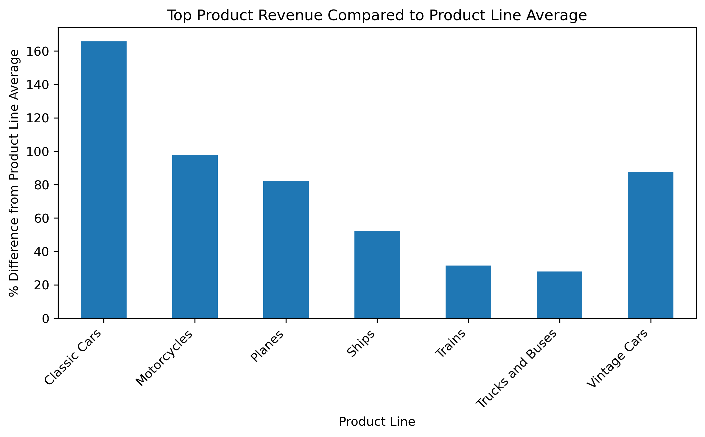
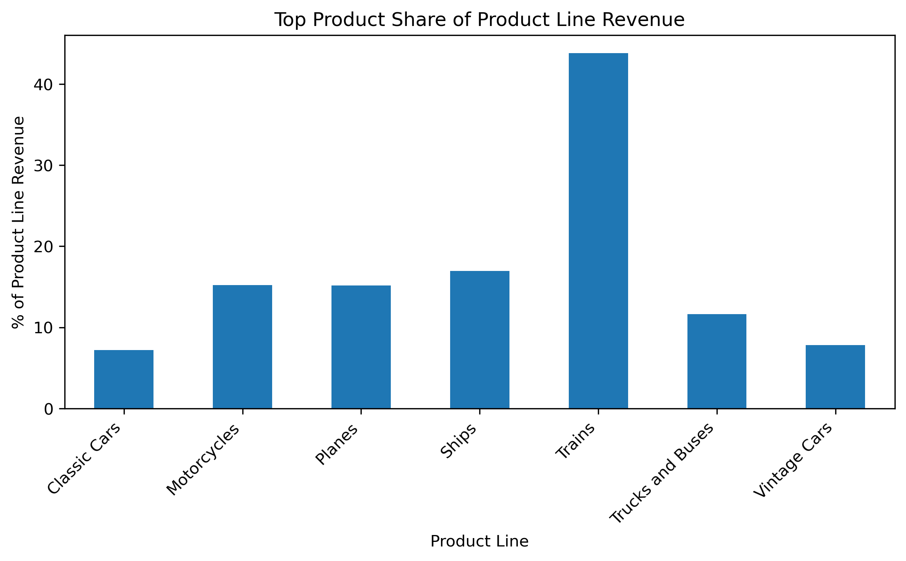
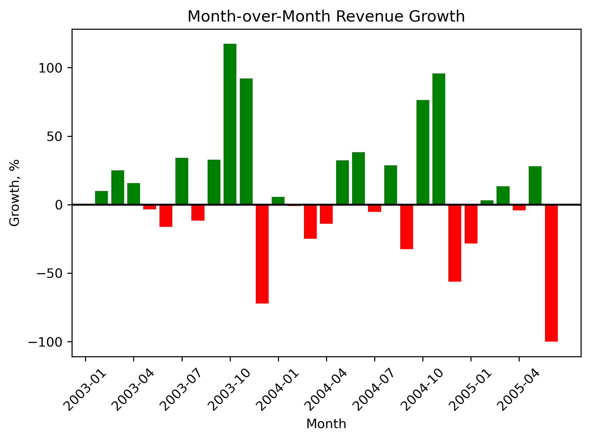
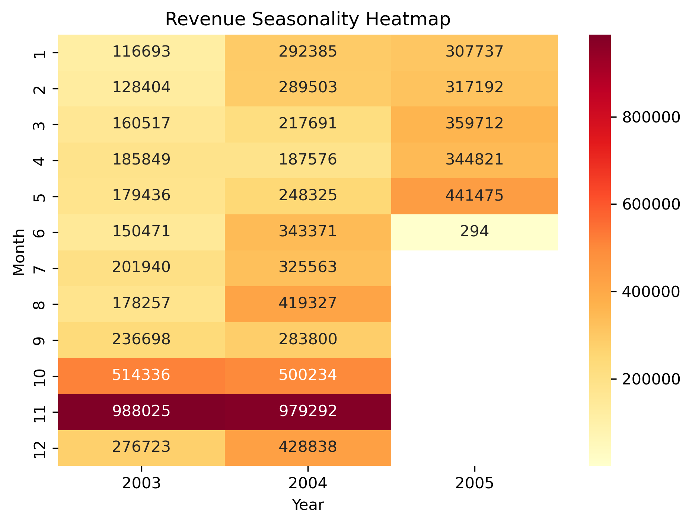
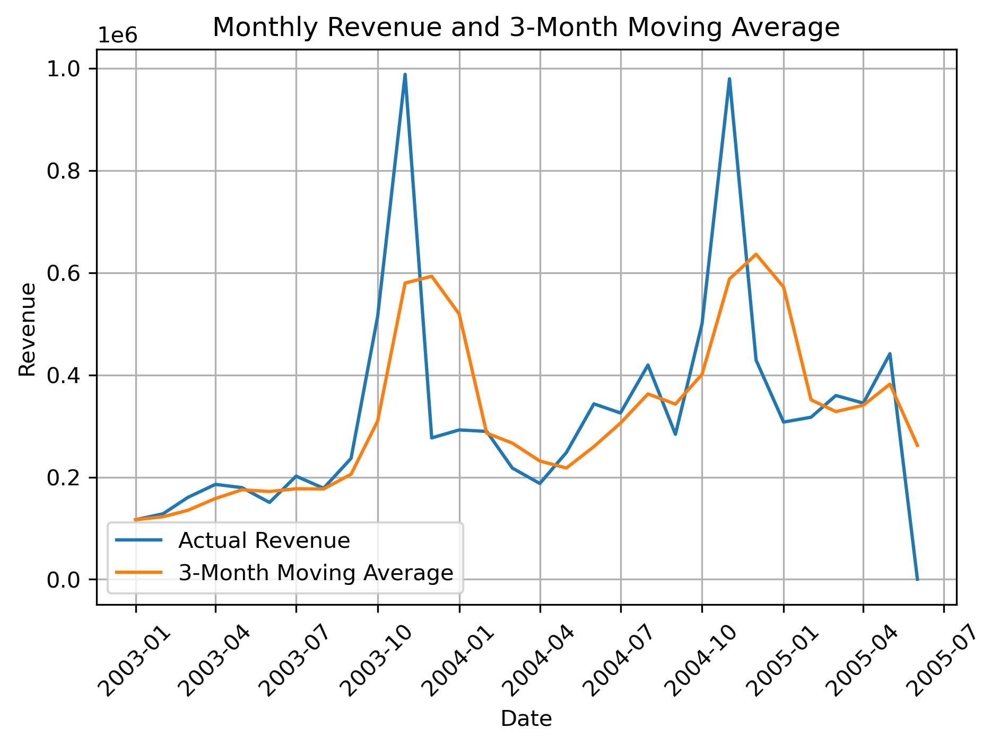
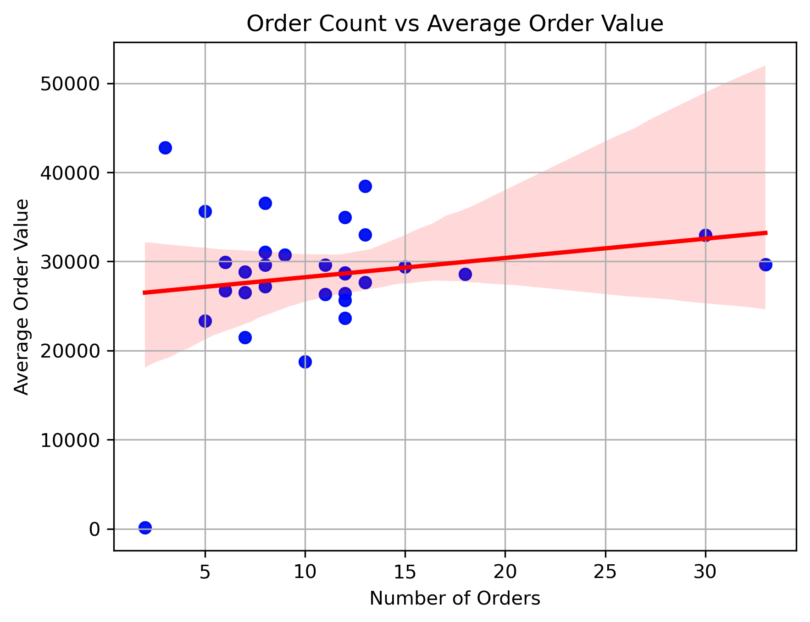

# Classicmodels Sales Analysis & ETL Pipeline

MySQL · Python/Pandas · Excel

## Overview

This project analyzes sales data from the ClassicModels database, which represents a model car sales business.

The goal was to analyze revenue performance, identify key markets and products, detect product concentration risks, and build a simple analytical ETL pipeline.

Pipeline:

MySQL → Python/Pandas → Excel



---

## Links

- [Sales Analysis Notebook](notebooks/01_Classicmodels_Sales_Analysis.ipynb)
- [ETL Pipeline Notebook](notebooks/02_Classicmodels_ETL_Pipeline.ipynb)
- [Excel Output](outputs/analysis_2004.xlsx)

---

## Dataset

MySQL ClassicModels database with sales, customer, product, and order data. 

Main tables used:

- "orders"
- "orderdetails"
- "customers"
- "products"

Additional API data:

- currency exchange rates

---

## What I Did

- Connected Python to a MySQL database using SQLAlchemy
- Wrote SQL queries with joins, aggregations, CTEs, and window functions
- Analyzed 2004 sales performance by country, customer, product, and product line
- Built product-level revenue and concentration analysis
- Created monthly revenue trend, seasonality, and moving average analysis
- Integrated live currency exchange data from an API
- Built a simple ETL pipeline: Extract → Transform → Load
- Exported reporting-ready tables to Excel

---

## Notebooks

### 1. Sales Analysis

"notebooks/01_Classicmodels_Sales_Analysis.ipynb"

Includes:

- revenue by country
- top customer analysis
- top products by revenue
- Pareto analysis
- revenue by product line
- product line concentration
- monthly sales dynamics
- seasonality heatmap
- moving average
- order count vs average order value

### 2. ETL Pipeline

"notebooks/02_Classicmodels_ETL_Pipeline.ipynb"

Includes:

- data extraction from MySQL
- currency API integration
- revenue and profit calculations
- summary tables by country and product line
- Excel export

Output:

`outputs/analysis_2004.xlsx`

---

## Key Metrics

| Metric | Value |
|---|---:|
| Total Revenue | ~$4.52M |
| Average Order Value | ~$29.9K |
| Top Market | USA |
| Top Product Line | Classic Cars |
| Products generating ~80% of revenue | 71 |
| Highest Product Line Concentration | Trains |

---

## Key Findings

**USA is the strongest revenue market.**  
The United States generated the highest total order amount in 2004 and was the company’s key market in the analyzed period.

**Mini Gifts Distributors Ltd. is the top customer in the USA.**  
This customer accounted for a noticeable share of the country’s total order amount, which makes customer concentration worth monitoring.

**Revenue is not overly dependent on one product.**  
The top product generated only a small share of total company revenue, meaning overall revenue is relatively diversified at the product level.

**71 products generate around 80% of total revenue.**  
The Pareto analysis shows that revenue is spread across a relatively broad product portfolio rather than concentrated in only a few bestsellers.

**Classic Cars and Vintage Cars are the strongest product lines.**  
Together, they generate more than half of total revenue.

**Trains show high internal concentration.**  
In the Trains product line, one product generates more than 43% of the line’s revenue, which may indicate dependency risk.

**Sales show possible seasonality.**  
Monthly revenue peaks often appear around October and November, suggesting a seasonal sales pattern.

---

## Visual Examples

### Revenue by Country



### Top 10 Products by Revenue



### Revenue by Product Line



### Top Product Revenue Compared to Product Line Average



### Top Product Share of Product Line Revenue



### Monthly Revenue Trend


### Month-over-Month Revenue Growth



### Revenue Seasonality Heatmap



### Three-Month Moving Average



### Relationship Between Order Count and Average Order Value




---

## Repository Structure

```text
ClassicModels_Sales_ETL_Analysis/
├── README.md
├── notebooks/
│   ├── 01_Classicmodels_Sales_Analysis.ipynb
│   └── 02_Classicmodels_ETL_Pipeline.ipynb
├── images/
│   ├── Total_Order_Amount_by_Country_in2004.png
│   ├── Top10_Products_by_Revenue.png
│   ├── Revenue_by_Product_Line.png
│   ├── TopProductRevenue_Compared_to_ProductLineAverage.png
│   ├── TopProductShare_of_ProductLineRevenue.png
│   ├── MonthlyRevenueTrend.png
│   ├── Month_over_Month_RevenueGrowth.png
│   ├── RevenueSeasonalityHeatmap.png
│   ├── MonthlyRevenue_and_3MonthMovingAverage.png
│   └── OrderCount_vs_AverageOrderValue.png
├── outputs/
│   └── analysis_2004.xlsx
├── .env.example
├── .gitignore
└── requirements.txt
